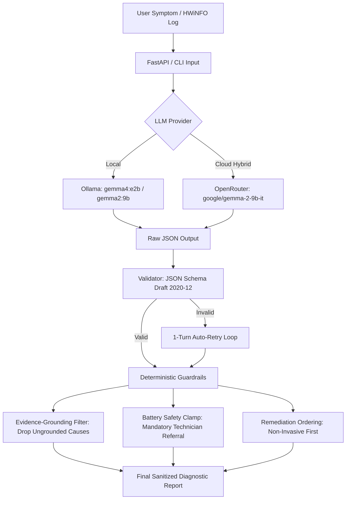

# Kyūmei (究明) — Local AI Hardware Diagnostics & Telemetry Reasoning

> **Submission for Hacktoberfest Hack Day Indore (PyData Indore × MLH)**  
> **Challenge Track:** *Best Open-Source AI Project*  
> **Author:** Swetabh Tripathy ([GitHub: @Tswetabh](https://github.com/Tswetabh))  
> **License:** [MIT License](LICENSE)  

[](https://agent-kyumei.embarko.app)
[](https://embarko.ai/showcase/app/agent-kyumei)
[](https://embarko.ai/showcase/hactoberfest-hack-days-indore)
[](https://agentkyumei.vercel.app)
[](tests/test_schema_and_guardrails.py)

---

## 📌 Live Deployments & Showcase

| Platform | URL | Status | Description |
|---|---|---|---|
| **Embarko (Primary Host)** | [https://agent-kyumei.embarko.app](https://agent-kyumei.embarko.app) | 🟢 Live & Permanent | Full cloud service deployment on Embarko container infrastructure. |
| **Embarko Showcase Listing** | [https://embarko.ai/showcase/app/agent-kyumei](https://embarko.ai/showcase/app/agent-kyumei) | 🟢 Published | Official showcase entry for the Kyūmei project. |
| **Event Showcase Board** | [https://embarko.ai/showcase/hactoberfest-hack-days-indore](https://embarko.ai/showcase/hactoberfest-hack-days-indore) | 🏆 Featured | Listed under Hacktoberfest Hack Days Indore (PyData Indore × MLH). |
| **Vercel Mirror** | [https://agentkyumei.vercel.app](https://agentkyumei.vercel.app) | 🟢 Live | Edge deployment with client-side UI and cloud showcase replay mode. |
| **GitHub Repository** | [https://github.com/Tswetabh/Agent-Kyumei](https://github.com/Tswetabh/Agent-Kyumei) | 📦 Open Source | Source code, test suites, Agent Skill package, and documentation. |

---

## 📖 Table of Contents
1. [What is Kyūmei?](#-what-is-kyūmei)
2. [Key Architecture & Guardrails](#-key-architecture--guardrails)
3. [Tools & Technologies Used](#-tools--technologies-used)
4. [Installation & Setup Guide](#-installation--setup-guide)
   - [Method 1: Local Setup with Ollama (Offline GPU Inference)](#method-1-local-setup-with-ollama-offline-gpu-inference)
   - [Method 2: Cloud Hybrid Setup with OpenRouter](#method-2-cloud-hybrid-setup-with-openrouter)
   - [Method 3: Standalone Headless Terminal CLI](#method-3-standalone-headless-terminal-cli)
5. [How-To-Use Guide & Features](#-how-to-use-guide--features)
   - [Tab 1: Hardware Fault Diagnostics](#tab-1-hardware-fault-diagnostics)
   - [Tab 2: HWiNFO64 Telemetry Log Analyzer](#tab-2-hwinfo64-telemetry-log-analyzer)
   - [Tab 3: Game & AI Workload Feasibility Estimator](#tab-3-game--ai-workload-feasibility-estimator)
   - [Tab 4: Rogue Process & Miner Triage](#tab-4-rogue-process--miner-triage)
6. [HWiNFO64 Sensor Data Recording Tutorial](#-hwinfo64-sensor-data-recording-tutorial)
7. [Testing & Verification](#-testing--verification)
8. [Contest Transparency & AI Disclosure](#-contest-transparency--ai-disclosure)

---

## 🔍 What is Kyūmei?

**Kyūmei (究明)** — Japanese for *"investigating the truth / thorough examination"* — is an open-source, edge-first hardware and device diagnostics reasoning assistant.

When a user encounters a PC failure, symptoms are usually messy, fragmented, or ambiguous:
> *"My laptop gets boiling hot on the bottom, the fan whines like a jet engine at idle, and it suddenly powers off after 20 minutes."*

Standard LLMs frequently hallucinate hardware advice: they suggest invasive component replacements without evidence, miss dangerous conditions, or propose fatal suggestions (such as telling a user to puncture a swollen lithium-ion battery).

**Kyūmei fixes this with deterministic neuro-symbolic triage:**
- Extracts verifiable, atomic evidence IDs (`E1`, `E2`, …) from raw text or sensor logs.
- Synthesizes candidate causes where **every cause must cite at least one verified evidence ID**.
- Enforces **hard deterministic code guardrails** that strip ungrounded causes and clamp battery safety hazards to professional technician referral.
- Sequences troubleshooting steps strictly from **safest / non-invasive software checks first** to **disassembly last**.
- Handles ambiguous symptoms gracefully by returning `needs_more_info` with 1-click diagnostic follow-up questions instead of guessing.

---

## ⚙️ Key Architecture & Guardrails



### Core Invariants:
1. **Evidence Grounding Invariant**: A cause cannot exist without an evidence trail. If the model outputs `caused_by: ["E9"]` and `E9` was never in the evidence list, the guardrail immediately drops the cause.
2. **Physical Safety Escalation**: Any symptom mentioning battery swelling, popping chassis seams, burning smell, or smoke triggers `safety_warning` and locks the remediation protocol to **STOP USE IMMEDIATELY & REFER TO CERTIFIED REPAIR TECHNICIAN**.
3. **Thin Evidence Triage (`needs_more_info`)**: If the symptom has fewer than 2 verifiable clues (e.g. *"computer won't turn on"*), the pipeline sets `status: "needs_more_info"` and generates 1 to 3 targeted discriminator questions.

---

## 🛠️ Tools & Technologies Used

| Domain | Technology | Purpose |
|---|---|---|
| **Language & Backend** | **Python 3.10+ / 3.14**, **FastAPI**, **Uvicorn**, **Pydantic v2** | High-performance asynchronous API, schema models, and static web serving. |
| **Local LLM Engine** | **Ollama** (`gemma4:e2b`, `gemma2:9b`, `llama3.1:8b`) | 100% offline, zero-data-leakage inference running locally on consumer GPUs (NVIDIA RTX 3050 6GB). |
| **Cloud LLM Hybrid** | **OpenRouter API** (`google/gemma-2-9b-it`) | Optional cloud provider fallback for serverless container environments. |
| **Standardization** | **Agent Skill Open Standard** (`SKILL.md`) | Interoperable agent skill package conforming to the open agent specification. |
| **Schema & Validation** | **JSON Schema (Draft 2020-12)**, `jsonschema` | Strict output format enforcement with automated 1-turn retry recovery. |
| **Frontend UI** | **Vanilla Modern CSS & JavaScript** (HTML5) | Zero-dependency, dark-mode glassmorphic interface with interactive bidirectional cross-highlighting. |
| **Hardware Telemetry** | **HWiNFO64** Sensor Export Logs (`.txt`, `.csv`) | Comprehensive hardware sensor capture (temps, fan RPMs, power limits, battery health). |
| **Testing Suite** | **Pytest** | Automated unit tests covering schema compliance, guardrails, and battery safety clamps. |
| **Cloud Hosting** | **Embarko** & **Vercel** | Containerized deployment and event showcase listing. |
| **AI Pair Programming** | **Google Antigravity IDE (Gemini)** | Scaffolding, documentation, and agent skill integration. |

---

## 🚀 Installation & Setup Guide

### Method 1: Local Setup with Ollama (Offline GPU Inference)

#### Prerequisites:
- Windows 10/11, Linux, or macOS.
- Python 3.10 or newer (tested on Python 3.14).
- [Ollama installed and running](https://ollama.com/).
- Git.

#### Step 1: Clone the Repository
```bash
git clone https://github.com/Tswetabh/Agent-Kyumei.git
cd Agent-Kyumei/kyumei
```

#### Step 2: Set Up Virtual Environment & Dependencies
```bash
# Create virtual environment
python -m venv .venv

# Activate on Windows (PowerShell):
.venv\Scripts\Activate.ps1

# Activate on Linux / macOS:
source .venv/bin/activate

# Install required packages
pip install -r requirements.txt
```

#### Step 3: Pull Open-Weight Model in Ollama
Make sure Ollama is running (`ollama serve`), then pull the model:
```bash
ollama pull gemma4:e2b
# Or use Gemma 2:
ollama pull gemma2:9b
```

#### Step 4: Configure `.env`
Copy the template configuration:
```bash
cp .env.example .env
```
Default parameters in `.env`:
```ini
OLLAMA_HOST=http://localhost:11434
KYUMEI_MODEL=gemma4:e2b
KYUMEI_PIPELINE_MODE=single
KYUMEI_TEMPERATURE=0.2
HOST=127.0.0.1
PORT=8000
```

#### Step 5: Launch the Web Interface
```bash
python -m uvicorn app.main:app --host 127.0.0.1 --port 8000 --reload
```
Open **[http://127.0.0.1:8000](http://127.0.0.1:8000)** in your browser!

---

### Method 2: Cloud Hybrid Setup with OpenRouter

If you are deploying Kyūmei on a cloud host (such as Embarko or Vercel) where local Ollama is not running in the container, you can enable live cloud inference via **OpenRouter**:

1. Obtain an API key from [OpenRouter](https://openrouter.ai/keys).
2. Set the following in your `.env` file or cloud environment settings:
```ini
OPENROUTER_API_KEY=sk-or-v1-xxxxxxxxxxxxxxxxxxxxxxxxxxxxxxxx
OPENROUTER_MODEL=google/gemma-2-9b-it
```
3. Restart or deploy the app. Kyūmei will automatically detect `OPENROUTER_API_KEY`, route inference to OpenRouter's OpenAI-compatible completions API, and update the status badge to `OpenRouter: google/gemma-2-9b-it`!

---

### Method 3: Standalone Headless Terminal CLI

Kyūmei includes a full-featured terminal CLI for script integration, headless server environments, or CI/CD pipelines:

```bash
# 1. Diagnose a symptom directly:
python -m app.cli "Laptop fan sounds like a jet engine and shuts down after 20 minutes of gaming"

# 2. Diagnose from a recorded HWiNFO64 sensor log:
python -m app.cli --file examples/hwinfo_thermal_throttle.txt

# 3. Output raw JSON report for downstream automation:
python -m app.cli "Playing 3D games causes checkered green/pink patterns on screen" --json

# 4. Use staged reasoning pipeline mode:
python -m app.cli "Laptop bottom is bulging near trackpad" --mode staged
```

---

## 🖥️ How-To-Use Guide & Features

The Kyūmei web interface contains 4 specialized diagnostic tabs:

### Tab 1: Hardware Fault Diagnostics
- **Input Symptom**: Enter any plain text description of a problem or click one of the pre-loaded challenge scenario buttons (*Thermal Throttling at Idle*, *GPU Artifacting*, *Trackpad Lifting*, or *Ambiguous Won't Turn On*).
- **Execution Mode**: Choose **Single-Pass** (faster, ~2-4s) or **Staged Pipeline** (deep dual-pass chain-of-thought).
- **Interactive Bi-Directional Cross-Highlighting**:
  - Hovering over any **Evidence badge** (`[E1]`, `[E2]`) dynamically highlights every candidate cause that depends on it.
  - Hovering over any **Cause badge** (`[C1]`, `[C2]`) highlights its supporting evidence in the original symptom box.
- **Safety Clamps**: Battery swelling or thermal runaway automatically displays high-contrast red warning banners and directs to safe handling procedures.
- **Click-to-Answer Follow-Up Questions**: If evidence is thin (`status: "needs_more_info"`), clicking any suggested question pre-fills your prompt to refine the diagnosis in 1 click.
- **Exporting**: Click **Copy JSON** for raw programmatic data or **Export Markdown** to generate a clean hardware service ticket.

---

### Tab 2: HWiNFO64 Telemetry Log Analyzer
- **Direct Upload / Paste**: Drag and drop any raw HWiNFO64 sensor export file (`.txt` or `.csv`) or paste raw telemetry text.
- **Sensor Distillation**: Automatically extracts and displays:
  - CPU Package & Core Temperatures (with thermal throttling flags highlighted).
  - PROCHOT (Processor Hot) power throttle reason flags.
  - GPU Core & Hot Spot Temperatures.
  - Fan Speeds (RPM).
  - System Memory & NVMe Drive Temps.
  - Battery Wear Level percentage.
- **1-Click AI Diagnosis**: Click **Analyze Telemetry** to pipe distilled sensor metrics directly into the diagnostic engine.

---

### Tab 3: Game & AI Workload Feasibility Estimator
- **Game Performance Checker**: Select a title (e.g. *Cyberpunk 2077*, *Black Myth: Wukong*, *GTA V*, *Red Dead Redemption 2*) and specify your hardware. Kyūmei estimates expected FPS, VRAM bottlenecks, and recommended graphics/DLSS settings.
- **Local AI Model Feasibility Checker**: Input a target LLM (e.g. *DeepSeek-R1-14B*, *Llama 3.3 70B*, *Gemma 4 E2B*) to assess whether your GPU VRAM and system RAM can run it smoothly under Ollama, or if quantization (Q4_K_M) / offloading is required.

---

### Tab 4: Rogue Process & Miner Triage
- **Process Analysis**: Paste active processes or suspicious high CPU/GPU usage at idle.
- **Malware & Miner Detection**: Distinguishes legitimate Windows background workers (`SearchIndexer.exe`, `TiWorker.exe`) from stealth crypto-jackers and repackaged crack executables.
- **Remediation**: Recommends immediate quarantine, safe process kill commands, and persistence inspection paths (`Task Scheduler`, `Startup`, `HKCU\Software\Microsoft\Windows\CurrentVersion\Run`).

---

## 📊 HWiNFO64 Sensor Data Recording Tutorial

HWiNFO64 is the gold standard for real-time hardware monitoring on Windows. Here is the step-by-step procedure to record sensor telemetry logs for Kyūmei:

```
┌──────────────────────────────────────────────────────────────────────────────────┐
│  HWiNFO64 RECORDING WORKFLOW                                                    │
│                                                                                  │
│  [1. Download HWiNFO64] ──> [2. Launch Sensors-Only] ──> [3. Start Logging]     │
│                                                                  │               │
│  [6. Import into Kyūmei] <── [5. Stop Logging] <── [4. Reproduce Crash/Lag]     │
└──────────────────────────────────────────────────────────────────────────────────┘
```

### Step 1: Download HWiNFO64
- Download the free installer or portable zip from the official site: **[https://www.hwinfo.com/download/](https://www.hwinfo.com/download/)**.
- If using the portable version, extract the zip to any folder.

### Step 2: Launch in "Sensors-only" Mode
- Run `HWiNFO64.exe`.
- In the initial startup dialog, **check the "Sensors-only" box** and click **Start**.
- You will see the main sensor monitoring window listing temperatures, voltages, fan speeds, and clock rates.

### Step 3: Configure Polling Rate (Recommended)
- Click the **Gear icon (Configure Sensors)** at the bottom-right.
- Under the **General** tab, ensure **Scan Interval** is set to `2000 ms` (2 seconds) or `1000 ms` (1 second for fast gaming spikes).
- Click **OK**.

### Step 4: Start Logging
- In the bottom-right corner of the sensor window, click the **Logging Start** icon (a spreadsheet page with a green plus or disk).
- HWiNFO will prompt you to choose where to save the log file. Name it `hwinfo_log.csv` (or `.txt`) and click **Save**.
- The icon will change to indicate logging is active.

### Step 5: Reproduce the Hardware Issue
- Run your system under the workload that triggers your problem:
  - **For Overheating / Throttling:** Run a stress test (Cinebench, FurMark, Prime95) or play your game for 10–15 minutes until stuttering or high fan noise occurs.
  - **For Idle Fan Noise:** Leave the computer sitting at the desktop with no foreground apps for 15 minutes.
  - **For Sudden Shutdowns:** Use the machine normally until the shutdown occurs (the log writes each line synchronously to disk, preserving the exact temperature prior to power loss).

### Step 6: Stop Logging
- Return to the HWiNFO sensor window and click the **Logging Stop** icon (the same button, now showing a red cross or stop symbol).

### Step 7: Analyze in Kyūmei
1. Open Kyūmei at [https://agent-kyumei.embarko.app](https://agent-kyumei.embarko.app) or your local `http://127.0.0.1:8000`.
2. Click **Tab 2: HWiNFO Telemetry**.
3. Drag & drop your saved log file into the dropzone (or open the log in Notepad, copy the top summary or lines, and paste into the box).
4. Kyūmei will instantly parse the critical metrics and provide a comprehensive diagnostic report!

#### Sample HWiNFO64 Log Snippet:
```csv
Sensor,Current,Minimum,Maximum,Average
CPU Package Temperature [°C],99.4,44.0,100.0,89.5
CPU Core Thermal Throttling [Yes/No],Yes,No,Yes,Yes
CPU Power Limit Reason (IA: PROCHOT),Yes,No,Yes,Yes
CPU Package Power [W],24.5,12.0,45.0,26.8
CPU Fan Speed [RPM],4920,0,5000,4200
GPU Temperature [°C],68.2,38.0,72.0,55.4
GPU Hot Spot Temperature [°C],79.1,45.0,83.0,66.2
GPU Fan Speed [RPM],4200,0,4500,3600
System Memory Used [MB],11420,4200,12100,8900
Battery Wear Level [%],12.5,12.5,12.5,12.5
Drive Temperature (NVMe SSD) [°C],56.0,35.0,59.0,48.2
```

---

## 🧪 Testing & Verification

Kyūmei includes an automated test suite verifying JSON schema validation, evidence-linking invariants, and battery safety clamps:

```bash
# Run pytest unit tests:
python -m pytest tests/test_schema_and_guardrails.py -v
```

### Expected Output:
```
============================= test session starts =============================
platform win32 -- Python 3.14.5, pytest-9.1.1, pluggy-1.6.0
rootdir: D:\Hacktoberfest\kyumei
plugins: anyio-4.15.1
collected 4 items

tests\test_schema_and_guardrails.py::test_valid_schema_passes PASSED    [ 25%]
tests\test_schema_and_guardrails.py::test_missing_required_fields_fails PASSED [ 50%]
tests\test_schema_and_guardrails.py::test_guardrail_drops_ungrounded_causes PASSED [ 75%]
tests\test_schema_and_guardrails.py::test_battery_safety_clamp PASSED   [100%]

============================== 4 passed in 0.42s ==============================
```

### Live Benchmark Runner:
To run the pre-recorded challenge scenarios through your active model and verify schema adherence:
```bash
python tests/run_examples.py
```

---

## 📜 Contest Transparency & AI Disclosure

In strict adherence to the **Hacktoberfest Hack Day Indore (PyData Indore × MLH)** contest guidelines and developer community integrity:

- **AI Tools Used:** **Google Antigravity IDE (Gemini)** was used as an AI pair programmer for boilerplate generation, CSS styling polish, and documentation structuring.
- **Human Authorship:** The conceptual architecture, Agent Skill specification ([skill/SKILL.md](skill/SKILL.md)), formal JSON Schema ([skill/schema.json](skill/schema.json)), deterministic guardrail algorithms ([app/guardrails.py](app/guardrails.py)), physical safety clamping rules, HWiNFO64 parser, and test evaluation on physical NVIDIA RTX 3050 hardware were conceived, engineered, and verified by the human author (**Swetabh Tripathy**).
- For a comprehensive, file-by-file transparency audit, see [AI_DISCLOSURE.md](AI_DISCLOSURE.md).

---

## 📄 License

This project is licensed under the **MIT License** — see the [LICENSE](LICENSE) file for details.
